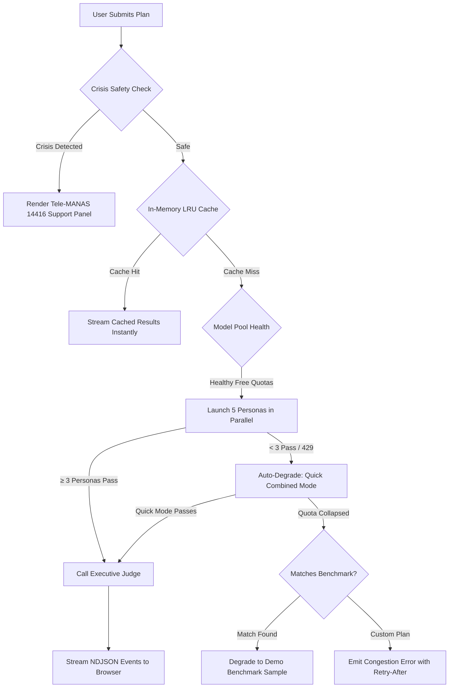
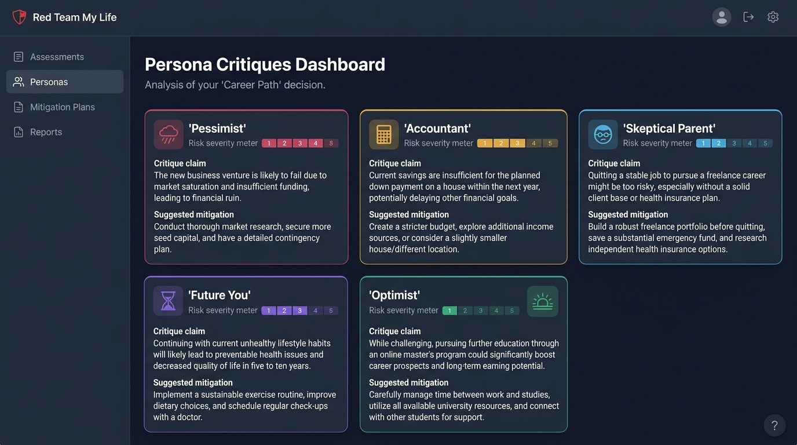
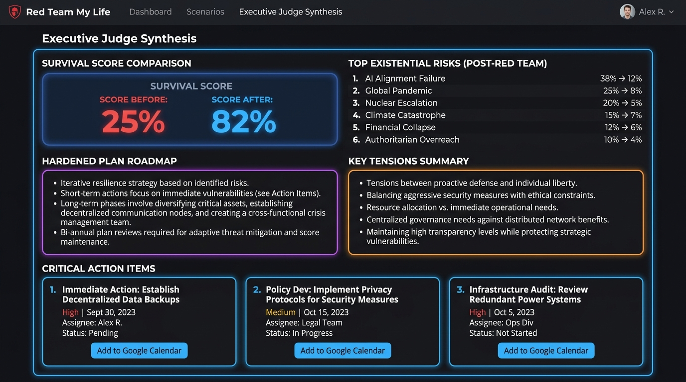

# Red Team My Life

> **Autonomous multi-agent council where 5 AI personas stress-test your life, career, and financial plans in parallel, synthesized by an Executive Judge into a battle-hardened roadmap.**

[](#testing--code-quality)
[](#testing--code-quality)
[](SECURITY.md)
[](docs/ACCESSIBILITY.md)
[](LICENSE)

---

## Hackathon Submission

- **Track**: **AI Personal Assistant & Autonomous Agents**
- **Live Demo**: `Live URL: (add after deployment)`

---

## The Problem

High-stakes life transitions—quitting a corporate job to build an indie startup, buying an expensive property, switching careers, or moving across the globe—suffer from a universal human failure mode: **the echo chamber of yes-men and uncalibrated optimism**.

Friends and family hesitate to ask the awkward, uncomfortable questions. Mentors often share generic platitudes. By the time reality exposes the structural blind spots—insufficient financial runway, single points of failure, unaddressed familial friction, or irreversible career penalties—it is often too late to adapt without painful personal and financial devastation.

---

## The Solution

**Red Team My Life** deploys an autonomous council of 5 specialized AI personas executing in parallel with strict cognitive lanes. They aggressively interrogate your plan from orthogonal adversarial perspectives before an **Executive Judge** synthesizes their critiques into an actionable, hardened roadmap.

```
                      ┌───────────────────────────────────────┐
                      │          Proposed User Plan           │
                      └──────────────────┬────────────────────┘
                                         ▼
                      ┌───────────────────────────────────────┐
                      │ Multilingual Crisis Safety Guardrail  │
                      │   (English, Hindi, Kannada check)     │
                      └──────────────────┬────────────────────┘
                                         │ Safe
                                         ▼
                      ┌───────────────────────────────────────┐
                      │    In-Memory LRU Cache (SHA-256)      │
                      └──────────────────┬────────────────────┘
                                         │ Cache Miss
                                         ▼
                      ┌───────────────────────────────────────┐
                      │ Quota-Aware Model Pool (RPM/RPD Gate) │
                      └──────────────────┬────────────────────┘
                                         │ Healthy
                                         ▼
         ┌───────────────────────────────┴───────────────────────────────┐
         │                 Parallel Live Council Attack                  │
         │                  (gemini-2.5-flash-lite)                      │
         ├──────────────┬──────────────┬──────────────┬──────────────────┤
         │              │              │              │                  │
         ▼              ▼              ▼              ▼                  ▼
   ┌───────────┐  ┌───────────┐  ┌───────────┐  ┌───────────┐      ┌───────────┐
   │ Pessimist │  │Accountant │  │ Skeptical │  │Future You │      │ Optimist  │
   │Execution &│  │ Runway &  │  │  Parent   │  │ Hindsight │      │ Strategic │
   │  Bottles  │  │Unit Econs │  │Reversible │  │ & Regret  │      │ Leverage  │
   └─────┬─────┘  └─────┬─────┘  └─────┬─────┘  └─────┬─────┘      └─────┬─────┘
         │              │              │              │                  │
         └──────────────┴──────────────┼──────────────┴──────────────────┘
                                       │ ≥ 3 Succeeded
                                       ▼
                      ┌───────────────────────────────────────┐
                      │   Executive Judge Synthesis Engine    │
                      │          (gemini-2.5-flash)           │
                      └──────────────────┬────────────────────┘
                                         ▼
        ┌─────────────────────────────────────────────────────────────┐
        │  • Before & After Survival Score (0–100)                    │
        │  • Top 3 Existential Risks & Mitigations                    │
        │  • Hardened Plan Roadmap                                    │
        │  • Unresolved Critical Questions                            │
        │  • 1-Click Google Calendar Action Links                     │
        └─────────────────────────────────────────────────────────────┘
```

### The 5 Autonomous Council Personas

1. **The Pessimist (Execution & Operations)**: Dissects single points of failure, operational bottlenecks, licensing delays, and dependency traps. Does not touch personal finances or family.
2. **The Accountant (Fiduciary Math)**: Builds an explicit mini-model. Calculates burn rate vs. savings, monthly runway, and break-even sales volume. Every unstated figure is explicitly branded `assumption: <range>`. Uses ₹ / lakh formatting when submitted in plan context.
3. **The Skeptical Parent (Family & Reversibility)**: Speaks directly to you ("you"). Probes the unaddressed impact on dependents, health insurance safety nets, fallback employment timelines, and the awkward conversations you've avoided having with loved ones.
4. **The Future You (Hindsight & Regret Asymmetry)**: Reflects in the first person ("I"). Evaluates emotional burnout, regret asymmetry (action vs. inaction), and irreversible career traps without financial jargon.
5. **The Optimist (Strategic Catalyst)**: Uncovers real, unpriced upside, asymmetric compounding opportunities, and high-leverage unfair advantages that other personas might overlook.

### The Executive Judge

The Judge synthesizes all 5 critiques, identifies the core ideological tensions between council members, evaluates your **Survival Score Before and After Mitigations (0–100)**, builds a rewritten **Hardened Plan**, and extracts **Action Items with 1-Click Google Calendar Links** so mitigations immediately land on your schedule.

---

## Architectural Flow & Auto-Degradation



---

## Google Services Used & Why

| Service | Why & How We Use It |
|---|---|
| **Google Gemini API** (`@google/genai`) | **Core Reasoning Engine**: Uses `gemini-2.5-flash-lite` for high-throughput, low-latency parallel persona critique, and `gemini-2.5-flash` for multi-perspective Judge synthesis. Employs **Native Structured JSON Output** (`responseMimeType: 'application/json'`, `responseSchema`) to enforce strict type guarantees and token efficiency, with configurable `LOW` thinking levels. |
| **Google Calendar Action Links** | **Actionability**: Dynamically constructs native Google Calendar Web event URLs (`calendar.google.com/calendar/render?action=TEMPLATE&text=...`) for each Judge action item, allowing users to transfer mitigation deadlines to their personal Google Calendar with a single click. |
| **Google Cloud Run** | **Production Hosting**: Production-ready containerization with multi-stage `Dockerfile` (`node:20-slim`, non-root user, minimal 512MB RAM footprint). Autoscales from 0 to 5 instances, using Cloud Run environment secrets and automated reverse proxy handling. |
| **Google Secret Manager** | **Zero Secret Exposure**: Securely injects `GEMINI_API_KEY` into Cloud Run without exposing tokens in environment files, container layers, or client code. |

---

## Key Engineering Decisions

- **Quota-Aware Model Pool**: Sliding-window tracking of Requests Per Minute (RPM) and midnight `America/Los_Angeles` daily quota counters (RPD). Automatically cycles through backup models (`gemini-2.5-flash-lite`, `gemini-2.0-flash-lite`) and enforces exponential backoff cooldowns when 429 status codes occur.
- **Three-Tier Graceful Auto-Degradation**:
  1. *Live Mode*: 5 parallel calls with single model fallback.
  2. *Quick Mode*: Automatically degrades to a single combined multi-agent call if fewer than 3 parallel personas succeed.
  3. *Demo Mode*: If quotas are exhausted, pre-saved benchmark data is loaded for matching plans. Custom plans are never served mismatched samples.
- **Prompt Injection Defense**: Strips delimiter tags (`<user_plan>`, `<persona_output>`) from user inputs and embeds untrusted inputs within strict boundary tags instructed to ignore role-reversal attempts.
- **Pre-Validation Output Sanitizer**: Truncates model output strings at clean word boundaries and slices excess array items before Zod schema validation, ensuring minor token overruns never crash the critique pipeline.
- **Multilingual Crisis Safety Guard**: Pre-flight regex and heuristic scanner detecting self-harm phrases across English, Hindi, and Kannada (both Devanagari/Kannada script and romanized transliterations). Halts evaluation and presents compassionate helpline information (Tele-MANAS 14416) without evaluating or saving the plan.
- **Zero-Latency NDJSON Streaming**: Server flushes newline-delimited JSON events over HTTP/1.1 as each persona finishes, allowing cards to shimmer and pop into view progressively on the frontend.
- **Abort & Disconnect Handling**: Express listens to client disconnects (`res.on('close')`) and triggers an `AbortController` signal to terminate active Gemini SDK requests, preventing zombie quota consumption.

---

## Screenshots

| Persona Critiques & Shimmer States | Executive Judge Synthesis & Hardened Plan |
|:---:|:---:|
|  |  |

---

## Security, Accessibility & Testing

- **Security**: Strict Content-Security-Policy (`default-src 'self'`), zero `innerHTML`, zero inline styles, no wildcard CORS, reverse proxy trust (`trust proxy`), request size caps (64 KB), and zero plan/secret logging. Read our complete audit in [SECURITY.md](SECURITY.md).
- **Accessibility**: Built to **WCAG 2.1 AA** standards. Includes high-visibility skip links, semantic landmarks, polite/assertive ARIA live regions, keyboard focus management, calibrated dark-mode contrast tokens (16:1), `@media (prefers-reduced-motion: reduce)`, 44px minimum touch targets, and non-color text severity labels. Read details in [docs/ACCESSIBILITY.md](docs/ACCESSIBILITY.md).
- **Testing**: **102 automated tests across 28 suites** with **97.9% code coverage** covering routes, schemas, rate limiting, orchestrator degradation, model pool sliding windows, and sanitization.

---

## Run It in 60 Seconds

### Prerequisites
- Node.js >= 20.0.0
- (Optional) Google Gemini API Key from [Google AI Studio](https://aistudio.google.com/)

### Quickstart
```bash
# 1. Clone the repository
git clone https://github.com/Sri7x7/Red-Team.git
cd Red-Team

# 2. Install dependencies
npm install

# 3. Create your environment file
cp .env.example .env

# 4. Choose your run mode in .env:
#    Option A: Run without API keys (serves pre-saved benchmark reviews)
#      DEMO_MODE=true
#    Option B: Run live multi-agent reviews with your Gemini API key
#      GEMINI_API_KEY=your_gemini_api_key_here
#      DEMO_MODE=false

# 5. Start the server
npm start
```

Open [http://localhost:3000](http://localhost:3000) in your browser.

---

## Deployment Options

- **Google Cloud Run**: Follow the automated deployment guide using Google Cloud SDK and Secret Manager in [docs/DEPLOY.md](docs/DEPLOY.md).
- **Vercel**: Native serverless deployment via `api/index.js` and `vercel.json`. See dashboard instructions in [docs/DEPLOY.md](docs/DEPLOY.md#6-vercel-deployment).

---

## Honest Limitations & Future Work

1. **Serverless In-Memory State**: In ephemeral serverless runtimes (like Vercel functions), the LRU cache and rate limiter exist in memory per container instance. Production multi-region deployments should wire a Redis/Cloud Memorystore backend into `src/services/cache.js`.
2. **Heuristic Safety Guard**: The crisis detection engine uses curated keyword and phrase matching across English, Hindi, and Kannada. While highly responsive and zero-latency, it is a heuristic defense and not a substitute for clinical psychological screening.
3. **Free-Tier Model Quotas**: Free-tier Gemini limits (15 RPM for Flash-Lite, 5 RPM for Flash) can experience congestion under heavy concurrent usage. The system's multi-tiered auto-degradation and global concurrency gate mitigate this by queuing and falling back seamlessly.

---

## License

MIT License. Designed with fiduciary rigor and operational skepticism.
